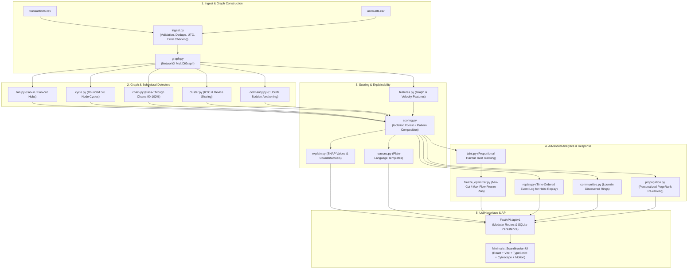

# MuleTrace: Build Plan & Architectural Blueprint

MuleTrace is a high-precision mule-network detection and response platform for bank and fintech fraud teams in India.
It detects multi-hop money layering, quantifies tainted stolen funds across the network, and optimizes the minimum-cut freeze set to stop the maximum rupees before cash-out.

---

## Architecture Overview

---

## Detailed Phase Breakdown

### Phase 1: Synthetic Data Generator & Evasion Engine
- `scripts/generate_data.py`:
  - Configurable `--seed` (default: 42) and `--evasion` (0.0 to 1.0).
  - Normal background: 5,000 accounts, ~60,000 transactions over 7 days, lognormal amounts, UPI/IMPS/NEFT channels.
  - Planted patterns:
    1. Fan-in/fan-out hub (8-12 victims in 20 min, >=90% forwarded to 4-6 accounts in 15 min).
    2. Cycles (lengths 3, 4, 5 completing within 45 min).
    3. Pass-through chains (two chains of 4-6 accounts, 95-99% forwarded in 2-8 min).
    4. New-account clusters (<30 days old sharing device/IP/phone/address).
    5. Dormancy ring (>=90 days dormant account awakens to move large sum).
  - Decoys: Payroll (paying 200 people), busy merchant, family on single device, refund loop, salary spike.
  - Noise: duplicates (1-2%), out-of-order timestamps, missing device/IP (~5%), self-transfers.
  - Evasion mechanics: delay hops, split amounts, add layering hops, rotate device identifiers.

### Phase 2: Ingestion, Graph, and Pure Detectors
- `backend/app/ingest.py`: Clean and validate CSVs, normalize UTC, deduplicate, drop self-transfers, generate data-health stats.
- `backend/app/graph.py`: Construct NetworkX MultiDiGraph with transaction attributes.
- `backend/app/detectors/`:
  - `fan.py`: Time-windowed fan-in/fan-out ratio analysis.
  - `cycle.py`: Bounded depth-first search for time-consistent cycles.
  - `chain.py`: Rapid forwarding pass-through chains with near-zero retained balance.
  - `cluster.py`: Disjoint-set union on shared KYC phone, device, IP, and address for accounts <30 days old.
  - `dormancy.py`: CUSUM change-point detection on dormant accounts suddenly transacting high volumes.

### Phase 3: Features, Scoring, and Plain-Language Reasons
- `backend/app/features.py`: In/out degree, unique counterparties, velocity, forward ratio, balance retention, entropy, new counterparty share.
- `backend/app/scoring.py`: Isolation Forest anomaly scoring combined with detector weights; risk score 0-100.
- `backend/app/reasons.py`: Deterministic templates creating a single coherent paragraph for each flagged entity.

### Phase 4: Advanced Analytics
- `backend/app/analytics/taint.py`: Haircut (proportional) taint propagation along time-respecting directed edges.
- `backend/app/analytics/freeze_optimizer.py`: Time-expanded flow network and minimum s-t cut for optimal account freezing.
- `backend/app/analytics/propagation.py`: Personalized PageRank from confirmed mule seeds, suppressing cleared accounts.
- `backend/app/analytics/communities.py`: Louvain community detection identifying dense, high-risk emerging rings.
- `backend/app/analytics/explain.py`: SHAP value calculation and counterfactual statement generation.
- `backend/app/analytics/replay.py`: Time-ordered event generator for playback with freeze simulation.
- `backend/app/analytics/redteam.py`: Benchmark framework evaluating detector recall against evasion levels.

### Phase 5: Modular API & Persistence
- Modular endpoints under `/api/v1` and `/api`:
  - Ingestion & Runs (`/ingest`, `/runs`, `/runs/{id}/health`)
  - Accounts & Graph (`/accounts`, `/accounts/{id}`, `/accounts/{id}/network`, `/accounts/{id}/taint`, `/accounts/{id}/explain`)
  - Decisions & Triage (`/accounts/{id}/decision`)
  - Rings & Planning (`/rings`, `/rings/{id}`, `/rings/discovered`, `/rings/{id}/freeze-plan`, `/rings/{id}/replay`)
  - Case Reports & Freezes (`/cases/{ring_id}/report`, `/freeze-requests`, `/export/sar/{account_id}`, `/export/csv`)
  - Analytics & Stats (`/stats`, `/model/performance`, `/simulate/evasion`, `/demo/reset`)
- Database models: Run, AccountResult, Decision, FreezeRequest, AuditLog.

### Phases 6–11: Scandinavian Minimalist Frontend
- Linear/Stripe design language: `--bg #FAFAF9`, `--surface #FFFFFF`, `--accent #6D4AFF`, `--risk-high #E8590C`.
- Screen Suite:
  1. Alerts Queue (`/alerts`) with Rapidpay-style table and sparkline.
  2. Investigation Workspace (`/workspace/:accountId`) with 3-pane layout, Cytoscape graph, time slider, SHAP drawer, and freeze plan action.
  3. Command Center (`/`) with KPI strip, rupees at risk, 7-day trend, and next best action card.
  4. Data Connect (`/upload`) with drag-and-drop CSV, column mapping, progress timeline, and demo load button.
  5. Case File (`/cases/:ringId`) with summary, transfer timeline, draft STR, and print stylesheet.
  6. Freeze Tracker (`/freezes`) with Kanban columns (Drafted, Sent, Held, Recovered, Missed).
  7. Heist Replay (`/replay/:ringId`) with scrub bar, 0.5x-4x speed, and freeze comparison.
  8. Rules Lab (`/rules`) with detector parameter sliders, live preview, and evasion response chart.
  9. Model Performance & Audit Log (`/performance`, `/audit`).
  10. Public Site (`/welcome`, `/patterns`, `/sandbox`, `/pricing`, `/security`).
  11. Mobile On-Call (`/m/alert/:ringId`).

### Phase 12: Evaluation, Automation, & Demo
- `scripts/evaluate.py`, `scripts/evaluate_evasion.py`, `scripts/seed_demo.py`.
- Documentation in `docs/algorithms.md`, `docs/evaluation.md`, `docs/demo-script.md`, `README.md`.
- `Makefile` and `docker-compose.yml`.
