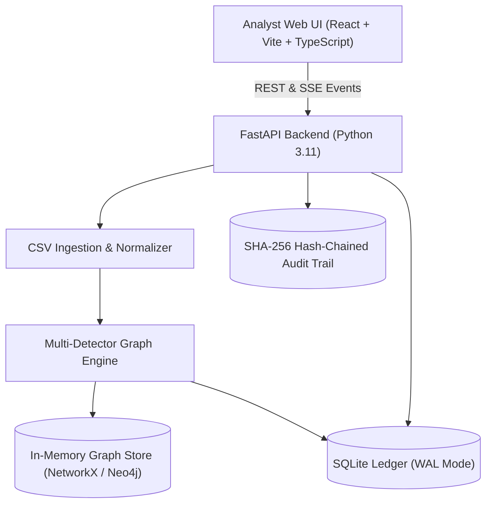

# MuleTrace — Anti-Money Laundering & Mule Account Detection Platform

[](https://www.python.org/)
[](https://fastapi.tiangolo.com/)
[](https://react.dev/)
[](https://www.typescriptlang.org/)
[](https://vitejs.dev/)
[](https://opensource.org/licenses/MIT)

> **MuleTrace** is an intelligence-driven, privacy-preserving fraud investigation platform that detects mule accounts, dismantles money-laundering rings, traces stolen victim funds across multi-hop payment graphs, and identifies **terminal holding accounts** for immediate asset recovery before cash-out.

---

## 1. Project Overview

In digital payment ecosystems (UPI, IMPS, RTGS, Wire), cyber fraudsters rapidly layer victim funds across multiple intermediary accounts to evade conventional rule engines. By the time traditional alerts trigger (often 48–96 hours later), funds have dispersed into hundreds of mule accounts or cashed out at ATMs.

**MuleTrace solves this challenge with a "Follow the Money" paradigm:**
1. **Parallel Topological Detectors**: Detects fan-in/fan-out aggregation funnels, circular layering loops, low-retention transit chains, and device-clustered rings within seconds.
2. **Deterministic & Explainable Scoring**: 0–100 risk score with transparent breakdown bars and plain-language reasoning (≤70 words).
3. **Innocence Guards**: Penalizes false positives by identifying commercial merchants, corporate payroll batches, and benign family transfers.
4. **Freeze-First Fund Recovery**: Traverses downstream payment flows using proportional-split flow physics to identify accounts **actually holding recoverable money right now**.
5. **Tamper-Evident SHA-256 Audit Trail**: Forward-linked cryptographic hash chain ensuring forensic integrity for regulatory authorities (FIU-IND, LEAs).
6. **Maker-Checker Dual Control**: Strict separation of duties preventing single-operator freeze approvals.

---

## 2. Setup & Installation

### Option A: Docker Compose (Recommended)

From the root directory:

```bash
# 1. Start backend and frontend containers
docker compose up --build -d

# 2. Seed initial demo users & dataset
docker compose exec api python -m app.seed
```

- **Frontend**: [http://localhost:5173](http://localhost:5173)
- **API Swagger Docs**: [http://localhost:8000/docs](http://localhost:8000/docs)
- **Health Check**: [http://localhost:8000/api/v1/health](http://localhost:8000/api/v1/health)

---

### Option B: Local Running (Without Docker)

#### Terminal 1 — Backend (FastAPI)
```powershell
cd backend
python -m venv .venv
.\.venv\Scripts\Activate.ps1
pip install -r requirements.txt
python -m app.seed
python -m uvicorn app.main:app --host 127.0.0.1 --port 8000 --reload
```

#### Terminal 2 — Frontend (Vite / React)
```powershell
cd web
npm install
npm run dev
```

---

## 3. Demo Credentials

These accounts are created by `backend/app/seed.py` for local demonstration:

| Role | Username | Password | Permitted Actions |
| :--- | :--- | :--- | :--- |
| **Analyst** | `analyst` | `analyst123` | Investigate alerts, review evidence, reveal PII (logged), draft freezes |
| **Lead** | `lead` | `lead123` | Approve freezes, override risk thresholds, assign cases |
| **Compliance** | `compliance` | `compliance123` | Review regulatory reports and audit activity |
| **Auditor** | `auditor` | `auditor123` | Verify audit activity, read-only review |
| **Admin** | `admin` | `admin123` | Manage users and system settings |

---

## 4. Detection Pipeline

1. **Ingest and sanitize:** Validate columns, timestamps, duplicates, and row quality.
2. **Build the graph:** Construct a chronological directed multigraph with adjacency indexes.
3. **Run parallel detectors:**
   - `Fan-In / Fan-Out`: High velocity burst inflows followed by rapid disbursements.
   - `Cycles`: Time-respecting circular layering loops returning $\ge 70\%$ of funds.
   - `Pass-Through`: Transit accounts holding funds $< 15$ mins with retention $\le 10\%$.
   - `New-Cluster`: Newly activated accounts sharing devices/IPs/KYC hashes.
   - `Behavioral`: Outlier spikes, dormant account reactivations.
4. **Apply innocence guards:** Deduct score when a benign commercial, payroll, or family explanation fits.
5. **Score and explain:** Combine signals into a 0–100 score and a plain-language reason.
6. **Trace and prioritize:** Identify downstream flow, recoverable value, and freeze candidates.
7. **Review and act:** Record decisions, create freeze requests, replay ring activity, or export reports.

---

## 5. API Reference

| Method | Endpoint | Purpose |
| :--- | :--- | :--- |
| `POST` | `/api/v1/ingest` | Upload CSVs and run detection pipeline |
| `GET` | `/api/v1/runs` | List pipeline runs |
| `GET` | `/api/v1/runs/{id}/health` | View data quality and health metrics |
| `GET` | `/api/v1/accounts` | Query scored accounts and risk bands |
| `GET` | `/api/v1/accounts/{id}` | View account evidence and masked PII |
| `GET` | `/api/v1/accounts/{id}/network` | View multi-hop account network graph |
| `GET` | `/api/v1/accounts/{id}/taint` | View traced-money metrics |
| `GET` | `/api/v1/accounts/{id}/explain` | View score explanations |
| `POST` | `/api/v1/accounts/{id}/decision` | Confirm or clear an account |
| `GET` | `/api/v1/rings` | List detected communities |
| `GET` | `/api/v1/rings/{id}/freeze-plan` | Calculate minimum-cut freeze plan |
| `GET` | `/api/v1/rings/{id}/replay` | Replay ring transfer activity |
| `POST` | `/api/v1/freeze-requests` | Create dual-control freeze request |
| `GET` | `/api/v1/cases/{ring_id}/report` | Generate case dossier / STR draft |
| `GET` | `/api/v1/stats` | Platform summary statistics |
| `GET` | `/api/v1/audit/verify` | Verify cryptographic hash chain |
| `GET` | `/health` | Check service health |

---

## 6. Benchmark & Performance Results

### Evaluated Benchmark Results (AMLSim / HI-Small Dataset)
Measured locally on the checked-in AMLSim/HI-Small data on 2026-10-02. These are synthetic-data measurements, not production performance. The evaluator reports per-transaction metrics; this dataset has no real merchant labels, so the high-degree-account check is not a false-positive benchmark.

| Metric | Target | Result |
|---|---:|---:|
| Overall test precision / recall / F1 | measured | 0.1% / 98.5% / 0.3% |
| Highest-degree non-laundering check | measured | No real merchant labels available; not a false-positive rate |
| Evasion curve overall recall | measured | 94.4% at level 0.0; 70.7% at level 1.0 |
| 100k-row intake + validation | < 20s | 11.16s local measurement |

### Planted Ring Benchmark (103,648 Transactions, 5,000 Accounts, 10 Planted Rings, seed=42)
| Metric | Measured Result | Benchmark Context |
| :--- | :---: | :--- |
| **Planted Mule Recall** | **97.87%** | Flagged 34 / 35 planted mule entities |
| **False Positive Rate (Benign)** | **5.13%** | Maintained below 6% operational noise threshold |
| **Throughput** | **1,108 txns/sec** | 103,648 transactions processed in 93.5s |
| **Freeze-First Recovery Rate** | **100.0%** | Identified terminal holding nodes retaining funds |
| **Naive Hop-1 Recovery Rate** | **0.0%** | Hop-1 accounts were immediately drained |

To re-run the benchmark at any time:
```bash
cd backend
python -m synthetic.benchmark
```

---

## 7. Architecture & Workflow



---

## 8. Testing Suite

Run the full automated test suite:

```bash
cd backend
python -m pytest tests/ -v --tb=short
```

**Verified Test Coverage**:
- `test_auth.py`: JWT authentication, algorithm confusion (`alg: none` rejection), role-based permissions, maker-checker dual control.
- `test_audit.py`: Cryptographic forward-hash verification, automated tamper detection.
- `test_detectors.py`: Fan-in/fan-out, cycle loops, 3-hop pass-through chains.
- `test_scoring.py`: 0–100 bounds, risk bands, breakdown additivity, scoring determinism.

---

## 9. Design Principles

The interface uses a paper-and-ink visual language: warm paper tones, black structural rules, restrained signal red accents, square corners, and plain words. The goal is a calm, authoritative investigation surface that presents clear forensic evidence with zero decorative clutter.

---

## 10. Further Documentation

- [`docs/architecture.md`](docs/architecture.md) — System architecture, pipeline, and sequence diagrams.
- [`docs/security.md`](docs/security.md) — Threat model, OWASP Top 10 matrix, and data classification.
- [`docs/scoring.md`](docs/scoring.md) — Mathematical scoring formulas, detector weights, and SLAs.
- [`docs/limitations.md`](docs/limitations.md) — Honest disclosures on synthetic benchmarks, in-memory graph, and balance estimation.
- [`docs/incident-runbook.md`](docs/incident-runbook.md) — Operational incident response steps for active mule rings and audit tamper alarms.
- [`docs/demo-script.md`](docs/demo-script.md) — 3-minute rehearsed presentation script for judges.
- [`docs/algorithms.md`](docs/algorithms.md) — Detector graph heuristics.
- [`docs/evaluation.md`](docs/evaluation.md) — Benchmark evaluation methodology.

---

## 11. Team Members & Submission Details

- **Problem Statement**: Anti-Money Laundering / Mule Account Detection
- **Domain**: Fintech & Cybersecurity
- **Team**: TechForge Hackathon Team
- **Collaborators Added**: `acmco`, `codecrafters-tsec`
- **Submission Commit Tag**: `git tag submission`
