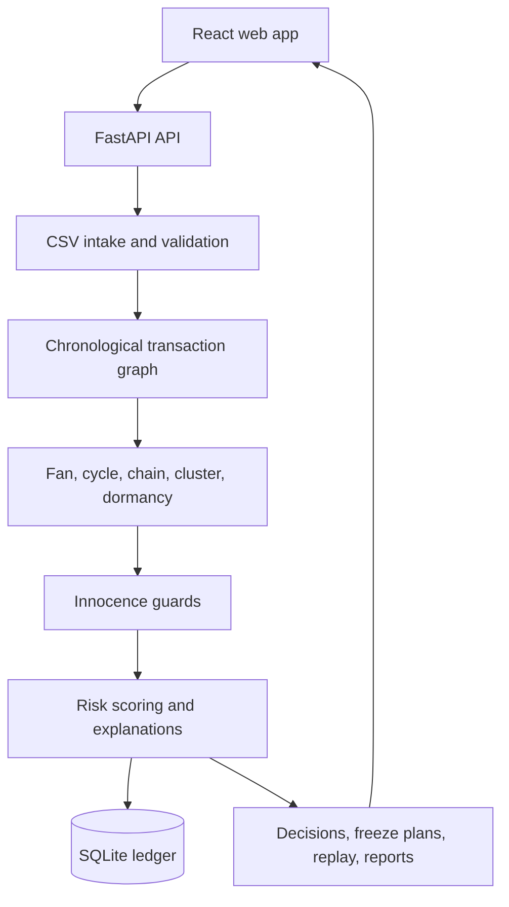

# MuleTrace

## Mule account detection for banks

MuleTrace helps investigators follow stolen money before it disappears. It finds accounts passing money along, shows the whole ring, explains why an account was flagged, and identifies where recoverable money may still be held.

> **Safety notice:** MuleTrace flags accounts for human review. It does not determine guilt. All benchmark and demo results use synthetic data. A person must confirm every decision, freeze, or regulatory report.

## Why It Matters

Fraud networks can move victim funds through several accounts within minutes. Each individual payment may look ordinary. The stronger signal is the shape of the account graph across time.

MuleTrace follows a **Detect -> Quantify -> Act** workflow:

1. **Detect** multi-hop rings with graph and behavioral detectors.
2. **Quantify** traced money and show the accounts holding recoverable funds.
3. **Act** with explainable decisions, freeze plans, replay, and case reports.

## What It Does

- Detects fan-in and fan-out collection hubs.
- Finds time-ordered cycles and quick pass-through chains.
- Groups new accounts sharing device, IP, or KYC attributes.
- Detects dormant accounts that become active in a burst.
- Applies innocence guards for payroll, merchants, families, and shared devices.
- Produces deterministic risk scores with plain-language reasons.
- Traces proportional money flow through downstream accounts.
- Recommends a small freeze set using a minimum-cut model.
- Records decisions and operational activity for review.
- Supports maker-checker freeze workflows and case reports.

## Architecture



The frontend uses the Vite proxy for local API calls. Set `VITE_API_URL` only when the API is hosted on another origin. The default local database is SQLite with WAL enabled, and the graph is held in memory for fast investigation queries.

## Quick Start

### Docker Compose

```bash
docker compose up --build
```

- Frontend: `http://localhost:3000`
- API: `http://localhost:8000`
- Swagger docs: `http://localhost:8000/docs`
- Health check: `http://localhost:8000/health`

### Local development

Terminal 1, backend:

```powershell
python -m venv .venv
.\.venv\Scripts\Activate.ps1
pip install -r backend/requirements.txt
python scripts/generate_data.py --seed 42 --evasion 0.0 --output-dir data
python scripts/seed_demo.py
make dev
```

Terminal 2, frontend:

```powershell
cd web
npm install
npm run dev
```

The Vite development server runs on `http://localhost:5173` and proxies `/api` requests to the backend.

Useful commands:

```bash
make test-backend
make build-web
make check-design
```

## Demo Credentials

These accounts are created by `backend/app/seed.py` for the local demo only.

| Role | Username | Password | Typical permissions |
|---|---|---|---|
| Analyst | `analyst` | `analyst123` | Investigate alerts, review evidence, draft freezes |
| Lead | `lead` | `lead123` | Approve freezes and assign cases |
| Compliance | `compliance` | `compliance123` | Review regulatory reports and audit activity |
| Auditor | `auditor` | `auditor123` | Verify audit activity, read-only review |
| Admin | `admin` | `admin123` | Manage users and system settings |

Never reuse these credentials outside the synthetic demo.

## Detection Pipeline

1. **Ingest and sanitize:** validate columns, timestamps, duplicates, and row quality.
2. **Build the graph:** create a chronological directed multigraph with adjacency indexes.
3. **Run detectors:** fan, cycle, chain, cluster, and dormancy signals run over the cleaned data.
4. **Apply guards:** lower confidence when a benign explanation fits the evidence.
5. **Score and explain:** combine signals into a 0-100 score and a plain-language reason.
6. **Trace and prioritize:** identify downstream flow, recoverable value, and freeze candidates.
7. **Review and act:** record a decision, create a freeze request, replay the ring, or export a case report.

## API Reference

| Method | Endpoint | Purpose |
|---|---|---|
| `POST` | `/api/v1/ingest` | Upload CSVs and run detection |
| `GET` | `/api/v1/runs` | List pipeline runs |
| `GET` | `/api/v1/runs/{id}/health` | View data health |
| `GET` | `/api/v1/accounts` | Query scored accounts |
| `GET` | `/api/v1/accounts/{id}` | View account evidence and masked PII |
| `GET` | `/api/v1/accounts/{id}/network` | View the account network |
| `GET` | `/api/v1/accounts/{id}/taint` | View traced-money metrics |
| `GET` | `/api/v1/accounts/{id}/explain` | View score explanations |
| `POST` | `/api/v1/accounts/{id}/decision` | Confirm or clear an account |
| `GET` | `/api/v1/rings` | List detected rings |
| `GET` | `/api/v1/rings/discovered` | List discovered communities |
| `GET` | `/api/v1/rings/{id}/freeze-plan` | Calculate a freeze plan |
| `GET` | `/api/v1/rings/{id}/replay` | Replay ring activity |
| `POST` | `/api/v1/freeze-requests` | Create a freeze request |
| `GET` | `/api/v1/cases/{ring_id}/report` | Generate a case report |
| `GET` | `/api/v1/stats` | View platform metrics |
| `POST` | `/api/v1/simulate/evasion` | Evaluate detector evasion |
| `POST` | `/api/v1/demo/reset` | Reset synthetic demo data |
| `GET` | `/health` | Check service health |

## Benchmark Results

Measured locally on the checked-in AMLSim/HI-Small data on 2026-10-02. These are synthetic-data measurements, not production performance. The evaluator reports per-transaction metrics; this dataset has no real merchant labels, so the high-degree-account check is not a false-positive benchmark.

| Metric | Target | Result |
|---|---:|---:|
| Overall test precision / recall / F1 | measured | 0.1% / 98.5% / 0.3% |
| Highest-degree non-laundering check | measured | No real merchant labels available; not a false-positive rate |
| Evasion curve overall recall | measured | 94.4% at level 0.0; 70.7% at level 1.0 |
| 100k-row intake + validation | < 20s | 11.16s local measurement |

These numbers are reference results, not a guarantee for uploaded data. Data quality and detector configuration affect every run.

## Security and Review Model

- Account identifiers and personal fields are masked where possible.
- Uploaded files are validated before detection.
- JWT secrets and environment files must stay outside source control.
- Audit activity should be verified before a case handoff.
- Freeze actions require authorized human review.
- Production use requires TLS, managed storage, backups, access controls, and credential rotation.

## Testing

```bash
pytest backend/tests -v
cd web
npm run build
```

The backend tests cover ingestion, detectors, analytics, API routes, uploads, scoring, and pipeline persistence. The frontend build runs TypeScript checking and the Vite production build.

## Further Reading

- [Architecture](docs/architecture.md) - runtime flow and investigation stages.
- [Scoring](docs/scoring.md) - detector signals, guards, and score boundaries.
- [Security](docs/security.md) - authentication, audit, and production controls.
- [Assumptions](docs/assumptions.md) - data and storage defaults.
- [Limitations](docs/limitations.md) - known demo and model boundaries.
- [Incident runbook](docs/incident-runbook.md) - first response for API, data, and audit issues.
- [Algorithms](docs/algorithms.md) - detector and graph details.
- [Demo script](docs/demo-script.md) - presentation flow.
- [Evaluation](docs/evaluation.md) - benchmark methodology.

## Design Principles

The interface uses a paper-and-ink visual language: warm paper, black rules, restrained signal red, square corners, and plain words. The goal is a calm investigation surface with enough evidence to support a decision and no decorative certainty.
