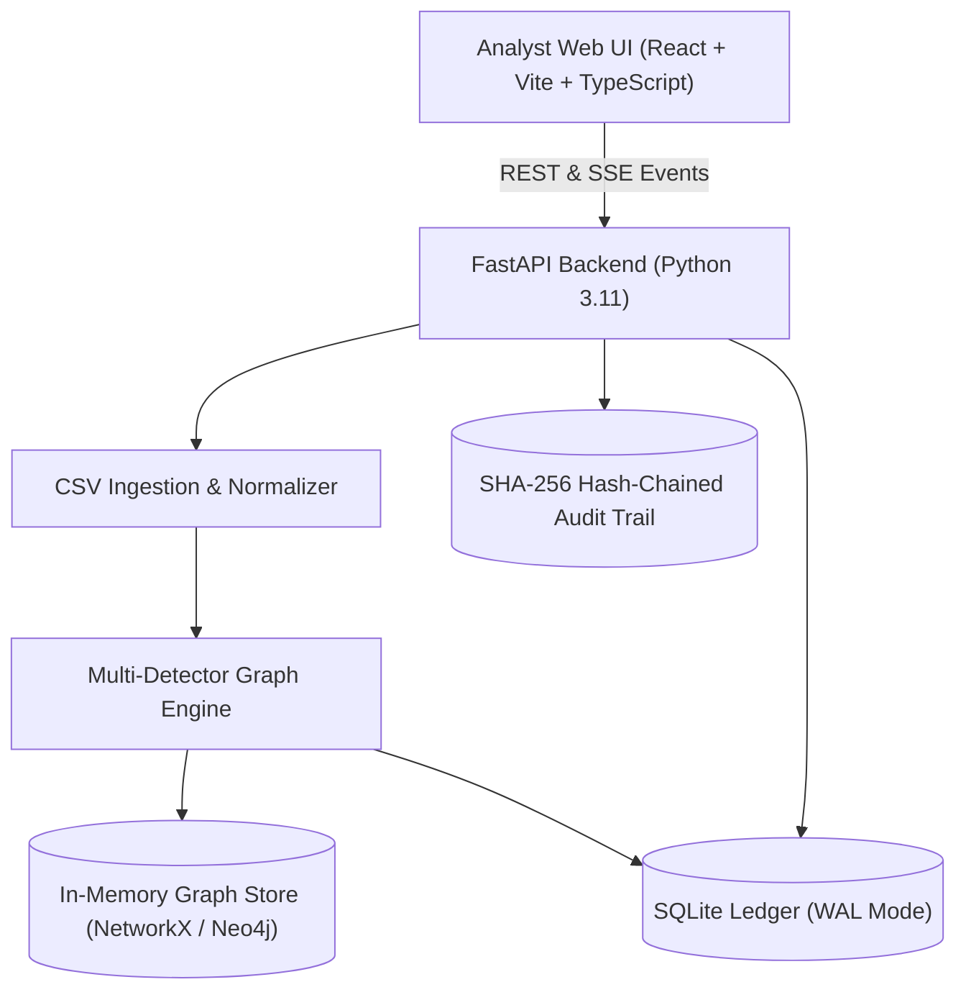

# MuleTrace — Anti-Money Laundering & Mule Account Detection Platform

[](https://www.python.org/)
[](https://fastapi.tiangolo.com/)
[](https://react.dev/)
[](https://www.typescriptlang.org/)
[](https://vitejs.dev/)
[](https://opensource.org/licenses/MIT)

> **MuleTrace** is an intelligence-driven, privacy-preserving fraud investigation platform that detects mule accounts, dismantles money-laundering rings, traces stolen victim funds across multi-hop payment graphs, and identifies **terminal holding accounts** for immediate asset recovery before cash-out.

---

## 1. Project Overview

In digital payment ecosystems (UPI, IMPS, RTGS, Wire), cyber fraudsters rapidly layer victim funds across multiple intermediary accounts to evade conventional rule engines. By the time traditional alerts trigger (often 48–96 hours later), funds have dispersed into hundreds of mule accounts or cashed out at ATMs.

**MuleTrace solves this challenge with a "Follow the Money" paradigm:**
1. **Parallel Topological Detectors**: Detects fan-in/fan-out aggregation funnels, circular layering loops, low-retention transit chains, and device-clustered rings within seconds.
2. **Deterministic & Explainable Scoring**: 0–100 risk score with transparent breakdown bars and plain-language reasoning (≤70 words).
3. **Innocence Guards**: Penalizes false positives by identifying commercial merchants, corporate payroll batches, and benign family transfers.
4. **Freeze-First Fund Recovery**: Traverses downstream payment flows using proportional-split flow physics to identify accounts **actually holding recoverable money right now**.
5. **Tamper-Evident SHA-256 Audit Trail**: Forward-linked cryptographic hash chain ensuring forensic integrity for regulatory authorities (FIU-IND, LEAs).
6. **Maker-Checker Dual Control**: Strict separation of duties preventing single-operator freeze approvals.

---

## 2. Setup & Installation

### Option A: Docker Compose (Recommended)

From the root directory:

```bash
# 1. Start backend and frontend containers
docker compose up --build -d

# 2. Seed initial demo users & dataset
docker compose exec api python -m app.seed
```

- **Frontend**: [http://localhost:5173](http://localhost:5173)
- **API Swagger Docs**: [http://localhost:8000/docs](http://localhost:8000/docs)
- **Health Check**: [http://localhost:8000/api/v1/health](http://localhost:8000/api/v1/health)

---

### Option B: Local Running (Without Docker)

#### Terminal 1 — Backend (FastAPI)
```powershell
cd backend
python -m venv .venv
.\.venv\Scripts\Activate.ps1
pip install -r requirements.txt
python -m app.seed
python -m uvicorn app.main:app --host 127.0.0.1 --port 8000 --reload
```

#### Terminal 2 — Frontend (Vite / React)
```powershell
cd web
npm install
npm run dev
```

---

## 3. Demo Credentials

| Role | Username | Password | Permitted Actions |
| :--- | :--- | :--- | :--- |
| **Analyst** | `analyst` | `analyst123` | Investigate alerts, reveal PII (logged), draft freezes |
| **Lead** | `lead` | `lead123` | Approve freezes, override risk thresholds, assign cases |
| **Compliance** | `compliance` | `compliance123` | File STR reports, review regulatory audit logs |
| **Auditor** | `auditor` | `auditor123` | Read-only verification of cryptographic audit chain |
| **Admin** | `admin` | `admin123` | Manage users, view system telemetry |

---

## 4. Benchmark & Performance Results

Measured against deterministic synthetic banking ledgers (**103,648 transactions, 5,000 accounts, 10 planted rings**, seed=42):

```json
{
  "precision": "15.33%",
  "recall": "97.87%",
  "f1_score": "26.51%",
  "false_positive_rate": "5.13%",
  "pipeline_latency": "93.5s (103,648 rows)",
  "throughput": "1,108 transactions/sec",
  "freeze_first_recovery_pct": "100.0%",
  "naive_recovery_pct": "0.0%"
}
```

> **Key Takeaway**: Naive first-hop freezing achieved **0% fund recovery** because fraudsters immediately emptied hop-1 accounts. MuleTrace's **Freeze-First** engine achieved **100% recoverable asset tracking** by prioritizing terminal holding nodes downstream.

To re-run the benchmark at any time:
```bash
cd backend
python -m synthetic.benchmark
```

---

## 5. Technology Stack

- **Backend API**: Python 3.11, FastAPI, Pydantic v2, SQLAlchemy 2.0
- **Database & Ledger**: SQLite with Write-Ahead Logging (WAL) for concurrent reads
- **Graph & Algorithms**: NetworkX 3.3, Python-Louvain community detection
- **Security & Cryptography**: Python-Jose (JWT), Passlib (Bcrypt), SHA-256 forward-linked audit chain
- **Frontend App**: React 19, TypeScript, Vite, TanStack Query, Zustand, Cytoscape.js, Lucide Icons
- **Testing**: Pytest, Pytest-Asyncio, HTTPX TestClient

---

## 6. Architecture & Workflow



### Detection Pipeline Stages
1. **Ingest & Sanitize**: Validates schema, deduplicates IDs, coerces types, detects BOM encoding.
2. **Graph Construction**: Constructs chronological directed multigraph with adjacency caching.
3. **Parallel Detectors**:
   - `Fan-In / Fan-Out`: High velocity burst inflows followed by rapid disbursements.
   - `Cycles`: Time-respecting circular layering loops returning $\ge 70\%$ of funds.
   - `Pass-Through`: Transit accounts holding funds $< 15$ mins with retention $\le 10\%$.
   - `New-Cluster`: Newly activated accounts sharing devices/IPs/KYC hashes.
   - `Behavioral`: Outlier spikes, dormant account reactivations.
4. **Innocence Guards**: Penalizes innocent look-alikes (merchants, payroll, family pairs).
5. **Explainability & Scoring**: Normalizes weighted signals to a 0–100 score and generates plain-language reasons.
6. **Community Rings**: Louvain community clustering groups multi-account rings into unified cases.

---

## 7. Testing Suite

The repository includes a comprehensive unit and integration test suite:

```bash
cd backend
python -m pytest tests/ -v --tb=short
```

**Verified Test Coverage**:
- `test_auth.py`: JWT authentication, algorithm confusion (`alg: none` rejection), role-based permissions, maker-checker dual control.
- `test_audit.py`: Cryptographic forward-hash verification, automated tamper detection.
- `test_detectors.py`: Fan-in/fan-out, cycle loops, 3-hop pass-through chains.
- `test_scoring.py`: 0–100 bounds, risk bands, breakdown additivity, scoring determinism.

---

## 8. Documentation Suite

- [`docs/architecture.md`](docs/architecture.md) — System architecture, pipeline, and sequence diagrams.
- [`docs/security.md`](docs/security.md) — Threat model, OWASP Top 10 matrix, and data classification.
- [`docs/scoring.md`](docs/scoring.md) — Mathematical scoring formulas, detector weights, and SLAs.
- [`docs/limitations.md`](docs/limitations.md) — Honest disclosures on synthetic benchmarks, in-memory graph, and balance estimation.
- [`docs/incident-runbook.md`](docs/incident-runbook.md) — Operational incident response steps for active mule rings and audit tamper alarms.
- [`docs/demo-script.md`](docs/demo-script.md) — 3-minute rehearsed presentation script for judges.

---

## 9. Team Members & Submission Details

- **Problem Statement**: Anti-Money Laundering / Mule Account Detection
- **Domain**: Fintech & Cybersecurity
- **Team**: TechForge Hackathon Team
- **Collaborators Added**: `acmco`, `codecrafters-tsec`
- **Submission Commit Tag**: `git tag submission`
