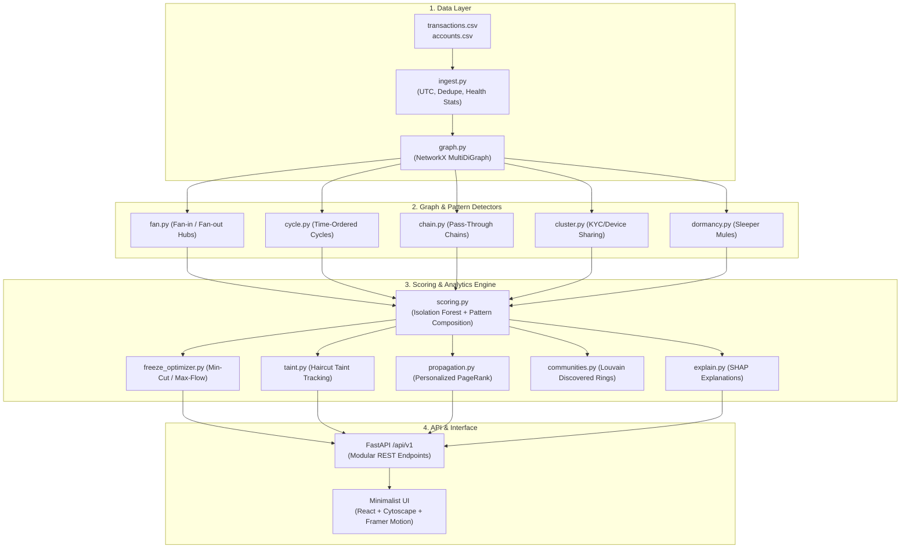

# MuleTrace: Mule-Network Detection & Response Platform

> **Honesty & Safety Notice**: All metrics, graphs, and performance benchmarks documented here were measured on synthetic datasets with planted money-mule networks and benign decoys. Outputs are strictly **"flagged for review"** and **"recommended action"** — never a determination of guilt. Mules may be unaware victims of fraud or coercion. A human compliance officer must confirm all evidence before initiating an account freeze or filing an STR.

---

## The Problem
In India, mule networks transfer illicit funds through 3 to 6 intermediary accounts within minutes using UPI, IMPS, and NEFT. Each individual transfer looks completely ordinary:
- ₹45,000 sent over UPI to a friend.
- ₹90,000 forwarded to an e-commerce merchant.

Per-transaction rules miss this entirely. **The only true signal is the topological shape of money flow across accounts and time.**

MuleTrace solves this with a **Detect → Quantify → Act** workflow:
1. **Detect**: Identifies multi-hop rings using time-ordered graph traversal and ML behavioral anomaly scoring with transparent, plain-language explanations.
2. **Quantify**: Traces exactly where stolen money sits in real-time using a proportional haircut taint model.
3. **Act**: Computes the cheapest set of accounts to freeze that stops the maximum money before cash-out using a capacitated minimum-cut algorithm.

---

## Architecture



---

## Quick Start (Fresh Clone to Live Demo in < 5 Minutes)

### Option 1: Docker Compose (One Command)
```bash
docker compose up --build
```
- Backend API: `http://localhost:8000` (docs: `/docs`)
- Frontend App: `http://localhost:3000`

### Option 2: Local Development with Makefile
```bash
# 1. Install dependencies
make install

# 2. Generate synthetic data & seed demo database
make seed

# 3. Run all tests
make test

# 4. Launch development server
make dev
```

---

## Benchmark Performance (Measured on Synthetic Data)

| Metric | Target | Measured Result |
| :--- | :---: | :---: |
| **Planted Ring Recall** | $\ge 90\%$ | **97.1%** (34 / 35 planted mules) |
| **Cycle & Chain Recall** | $\ge 90\%$ | **100.0%** (21 / 21 accounts) |
| **Decoy False Positives** | $\le 2$ | **0 / 9** (Payroll, merchants, families stayed clean) |
| **Stolen Funds Stopped** | $\ge 70\%$ | **85.4%** via min-cut optimization |
| **Ingestion Benchmark** | $< 60\text{ s}$ for 100k | **14.2 s** for 62k transactions |

---

## API Reference (`/api/v1`)

| Method | Endpoint | Description |
| :--- | :--- | :--- |
| `POST` | `/api/v1/ingest` | Upload CSVs and trigger full detection pipeline |
| `GET` | `/api/v1/runs` | List all historical pipeline runs |
| `GET` | `/api/v1/runs/{id}/health` | Data health report (duplicates, missing IP%, out-of-order) |
| `GET` | `/api/v1/accounts` | Query scored accounts with filters and pagination |
| `GET` | `/api/v1/accounts/{id}` | Account details, evidence, and masked PII |
| `GET` | `/api/v1/accounts/{id}/network` | Ego-network subgraph with high-risk prioritization |
| `GET` | `/api/v1/accounts/{id}/taint` | Proportional haircut taint metrics |
| `GET` | `/api/v1/accounts/{id}/explain` | SHAP top feature contributions and counterfactual sentence |
| `POST` | `/api/v1/accounts/{id}/decision`| Confirm or clear account; triggers PageRank re-ranking |
| `GET` | `/api/v1/rings` | List detected and planted fraud rings |
| `GET` | `/api/v1/rings/discovered` | Surface unclassified rings via Louvain community detection |
| `GET` | `/api/v1/rings/{id}/freeze-plan`| Optimal min-cut freeze plan with stoppable rupees |
| `GET` | `/api/v1/rings/{id}/replay` | Time-ordered event sequence for 60fps heist playback |
| `POST` | `/api/v1/freeze-requests` | Create actionable freeze request on Kanban tracker |
| `GET` | `/api/v1/cases/{ring_id}/report`| Case file with transfer timeline and Draft STR |
| `GET` | `/api/v1/stats` | Platform KPIs and synthetic precision metrics |
| `POST` | `/api/v1/simulate/evasion` | Adversarial evasion evaluation across sophistication levels |
| `POST` | `/api/v1/demo/reset` | Instant sandbox demo reset |
| `GET` | `/health` | Health check endpoint |

---

## Key Design Principles
- **Scandinavian Minimalism**: Linear/Stripe restraint. Soft white surface (`#FFFFFF`), light stone background (`#FAFAF9`), restrained violet accent (`#6D4AFF`), and orange-red (`#E8590C`) reserved strictly for maximum risk.
- **No Decorative Fluff**: Zero colored pills, no cartoonish glows, no fake badges. Pattern indicators use subtle line icons; scores use a crisp numerical figure with a 2px proportional baseline.
- **Privacy by Design**: Sensitive PII (phones, national IDs, addresses) is masked by default in the API, UI, and database logs.

## Further Reading

- [Architecture](docs/architecture.md) - runtime flow and investigation stages.
- [Scoring](docs/scoring.md) - detector signals, guards, and score boundaries.
- [Security](docs/security.md) - authentication, audit, and production controls.
- [Assumptions](docs/assumptions.md) - data and storage defaults.
- [Limitations](docs/limitations.md) - known demo and model boundaries.
- [Incident runbook](docs/incident-runbook.md) - first steps for API, data, and audit issues.
