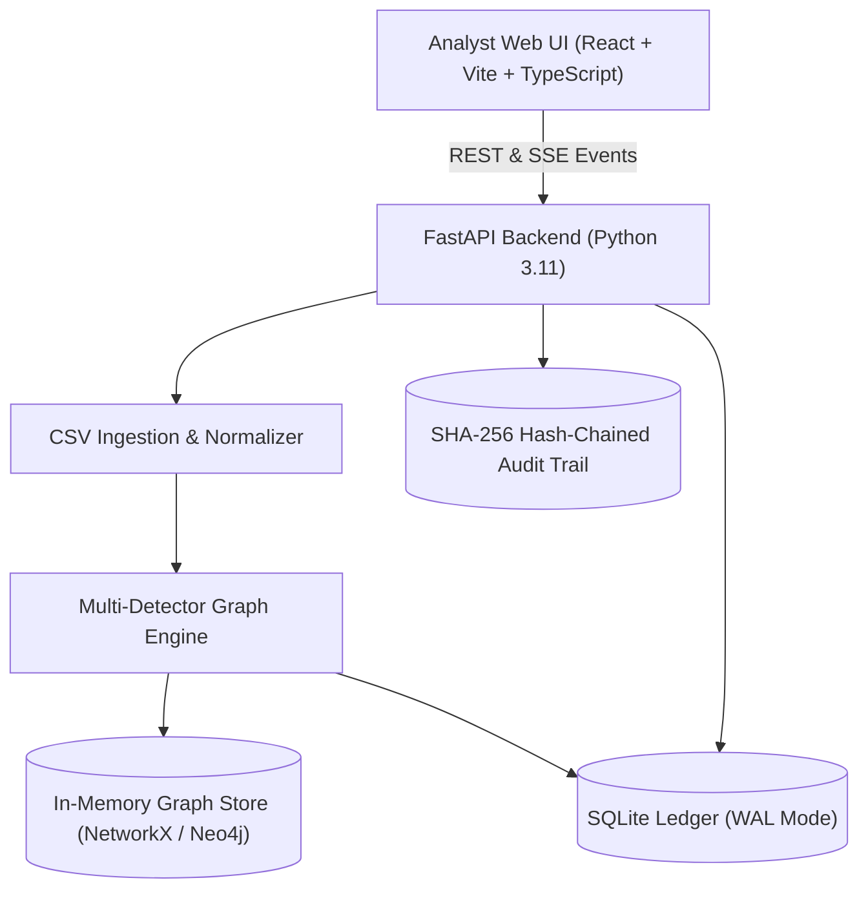
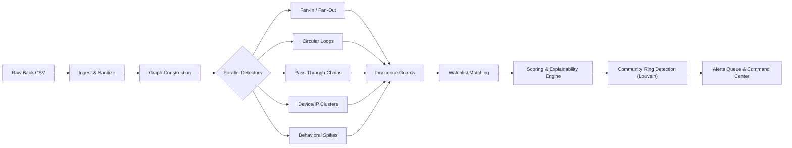
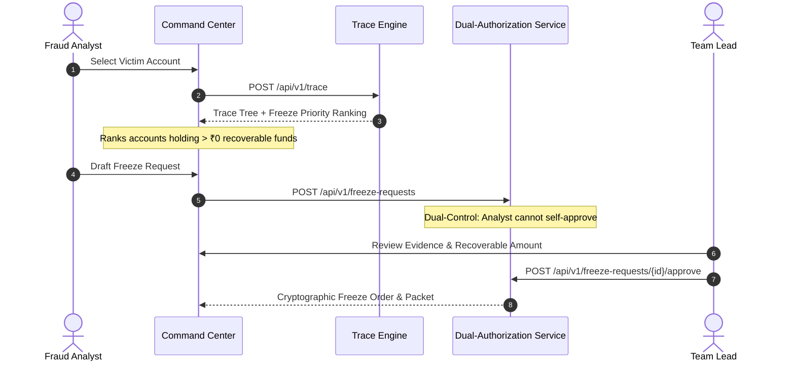
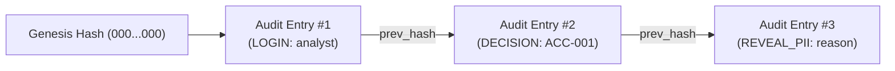

# MuleTrace — System Architecture & Workflow

MuleTrace is an enterprise-grade mule account detection, money flow tracing, and fund recovery platform built for financial crime investigation units, fraud analysts, and regulatory compliance teams.

---

## 1. High-Level System Architecture

The frontend uses the Vite development proxy for local API calls. Set `VITE_API_URL` only when the API is hosted on another origin.

---

## 2. Detection Pipeline Architecture

The detection pipeline processes raw financial ledgers in chronological order through a sequence of modular stages:

---

## 3. Investigation & Freeze-First Fund Recovery Workflow

Unlike legacy rule engines that alert sequentially from victim to hop 1, MuleTrace traverses the entire propagation tree using proportional-split flow physics and identifies terminal holding accounts holding stolen funds.

---

## 4. Cryptographic Audit Chain Architecture

Every user action (login, PII reveal, decision, freeze, config override) is hashed and appended to an append-only cryptographic ledger.

$$\text{Hash}_n = \text{SHA256}\left(\text{Hash}_{n-1} \,\|\, \text{Payload}_n\right)$$

Any retrospective alteration to database rows causes an immediate verification mismatch when `/api/v1/audit/verify` is triggered.
