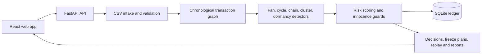

# MuleTrace Architecture

MuleTrace is a React and FastAPI investigation tool for following money through account graphs.

## Runtime Flow

The frontend uses the Vite development proxy for local API calls. Set `VITE_API_URL` only when the API is hosted on another origin.

## Investigation Flow

1. Upload transaction and account data.
2. Validate columns, timestamps, duplicates, and missing fields.
3. Build a time-ordered graph and run the detector set.
4. Review plain-language reasons and linked accounts.
5. Mark an account as mule or not a mule.
6. Review the freeze plan, replay, and case report.
7. Confirm every action in the audit log.

The graph and detector results are derived from synthetic demo data unless a user uploads a different dataset.
